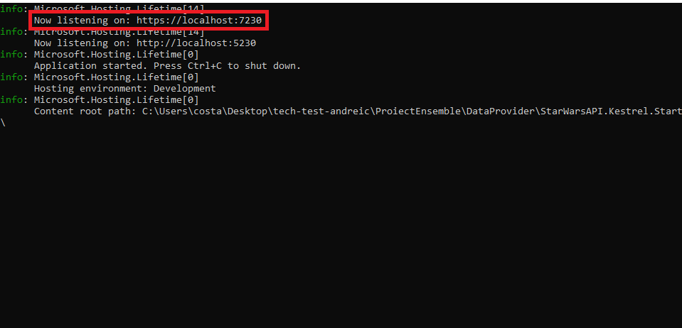

The app is made using .NET 6. 
Please use Visual Studio 2022, or Visual Studio 2019 with preview in all the .csproj for the TargetFramework property. 
Steps: 
Enter Visual Studio 
Open the app 
Run the application 
Get the localhost link where the server listens 
 
Enter postman: 
Use the endpoints: 

Note: You need to change the localhost port to the one that you have in your console 

Generic endpoints 
https://localhost:7230/films/ 
https://localhost:7230/people/ 
https://localhost:7230/planets/ 
https://localhost:7230/species/ 
https://localhost:7230/starships/ 
https://localhost:7230/vehicles/ 
https://localhost:7230/root/ 

Films endpoints 
https://localhost:7230/films/episode_id={id}/characters/ 
https://localhost:7230/films/episode_id={id}/planets/ 
https://localhost:7230/films/episode_id={id}/starships/ 
https://localhost:7230/films/episode_id={id}/vehicles/ 
https://localhost:7230/films/episode_id={id}/species/ 

And for searching based on a property and a value: 
https://localhost:7230/films/propertyName={propertyName}&value={value} 
https://localhost:7230/people/propertyName={propertyName}&value={value} 
https://localhost:7230/planets/propertyName={propertyName}&value={value} 
https://localhost:7230/species/propertyName={propertyName}&value={value} 
https://localhost:7230/starships/propertyName={propertyName}&value={value} 
https://localhost:7230/vehicles/propertyName={propertyName}&value={value} 

Where the property is the property that you look for to search, and the value is the value for what you are searching. 
Note: Make sure that the property given is valid and not a list. 
If one of the values given are not valid, the endpoint will return an empty null and you can see what was the issue  
in the console of the server. 

For example: 
Search by blue eyes in people: 
https://localhost:7230/people/propertyName=eye_color&value=blue 
https://localhost:7230/starships/propertyName=id&value=66 

NOTE: It does not support dates, I have code for dates but I didn't wanted it to add it, since the dates are all in the same day, at the same hour and minute
	  It does not support the url property, please search by id

The app could have been improved using a database, to persist the data, but I didn't want to make the app complicated for such a little database.
The main issue that I find about this is that some endpoints may take more time, but that's were the IdentityMap comes in and rescue the situation
since if the entities looked for were already retrieved, they will get returned instantly.

P.S: I've made a commit with all the changes because I was in a hurry, sorry.